# STM32WBA-BLE-Weight-Scale

* The STM32WBA-BLE-Weight-Scale demonstrating Bluetooth® SIG [Weight Scale Profile 1.0](https://www.bluetooth.org/docman/handlers/downloaddoc.ashx?doc_id=293525) example, based on STM32CubeWBA v1.3.1
 
## Hardware Needed

  * This example runs on STM32WBAxx devices.
  * Connect the Nucleo Board to your PC with a USB cable type A to mini-B to ST-LINK connector (USB_STLINK). 

## User's Guide

1) Run this Bluetooth® Low Energy Weight Scale project where the STM32WBA will advertise

2) Use one of the following remote interfaces to interact with your device: <a href="https://wiki.st.com/stm32mcu/wiki/Connectivity:BLE_smartphone_applications#Bluetooth-C2-AE_LE_collector_applications_for_STM32WBA
"> Bluetooth LE collector applications for STM32WBA.</a>
   On the smartphone, download the <a href="https://wiki.st.com/stm32mcu/wiki/Connectivity:BLE_smartphone_applications#Bluetooth-C2-AE_LE_collector_applications_for_STM32WBA
"> Bluetooth LE collector applications for STM32WBA.</a> application.

With the ANDROID/IOS ST BLE Toolbox application to connect with this Bluetooth® Low Energy [Weight Scale Profile 1.0](https://www.bluetooth.org/docman/handlers/downloaddoc.ashx?doc_id=293525) (WSS_XX where XX is the 2 last digit of the Bluetooth® Device Address)
  
   Scan on ANDROID/IOS:
   

       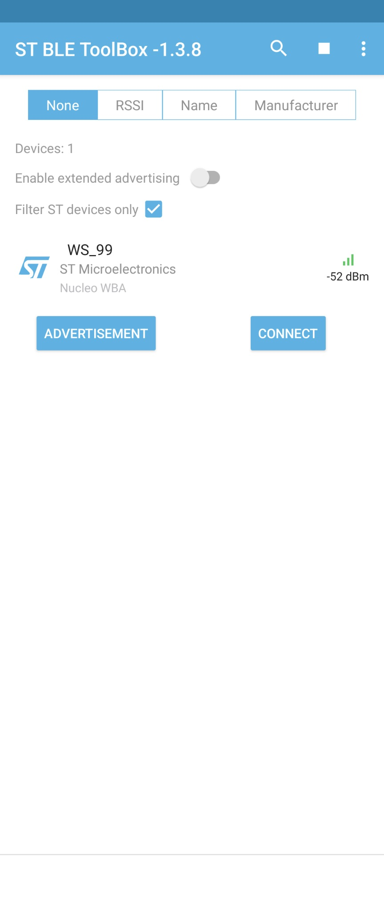
   

   
   After Connection select the Bond button to pair the device.
   
   After Pairing and Selecting the [Weight Scale Service 1.0](https://www.bluetooth.org/docman/handlers/downloaddoc.ashx?doc_id=293526) on ANDROID/IOS you will see the following Characteristics:
   

       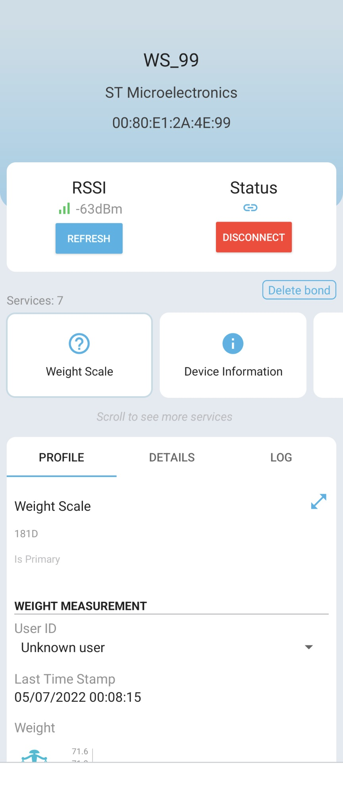
       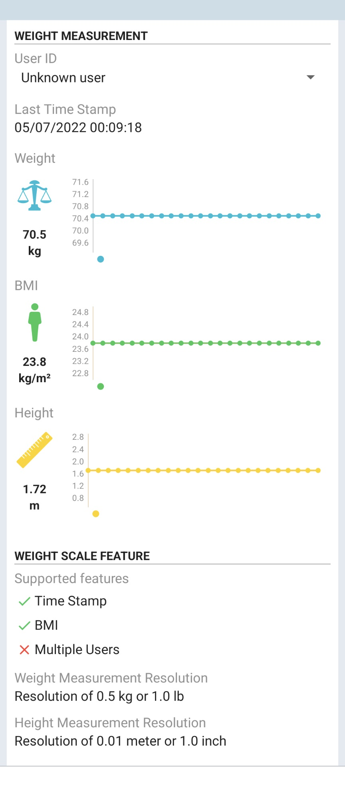
   

   
   When Selecting the [Body Composition Service 1.0](https://www.bluetooth.com/specifications/specs/body-composition-service-1-0/) you will see the following Characteristics:
   

       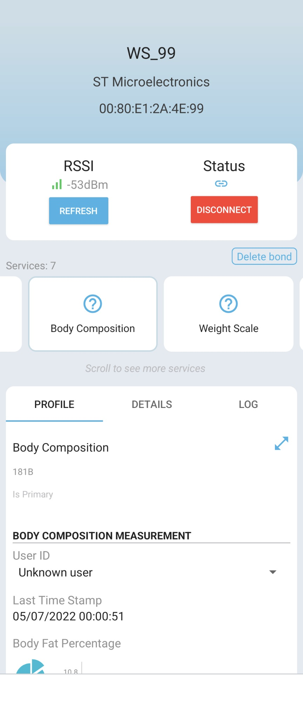
       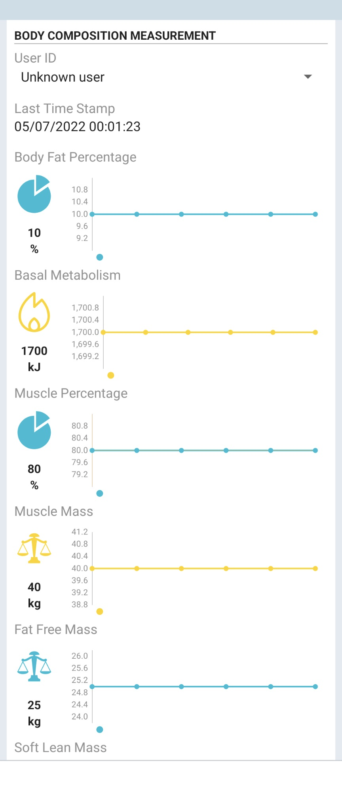
       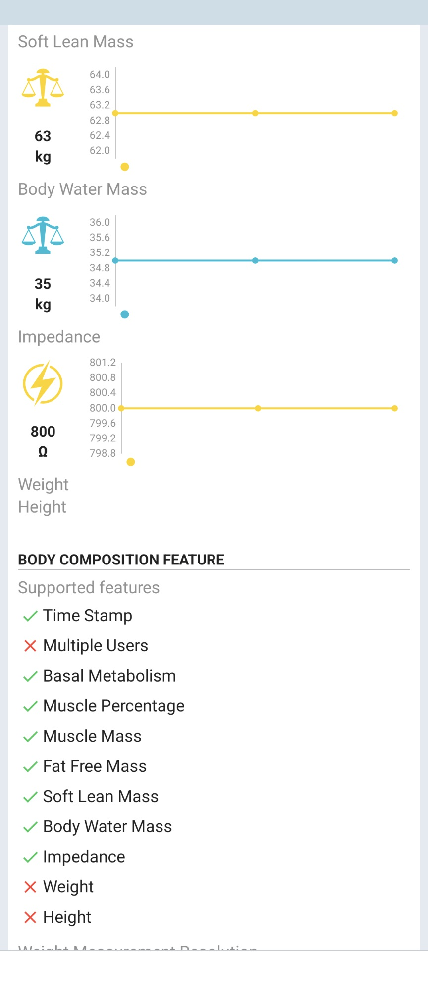
       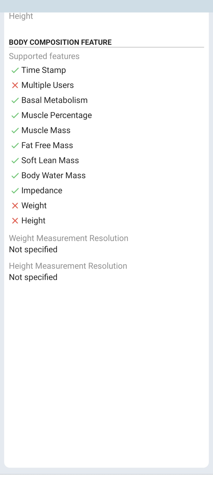
   

	
   When Selecting the [Current Service 1.1](https://www.bluetooth.com/specifications/specs/current-time-service-1-1/) you will see the following Characteristics:
   

       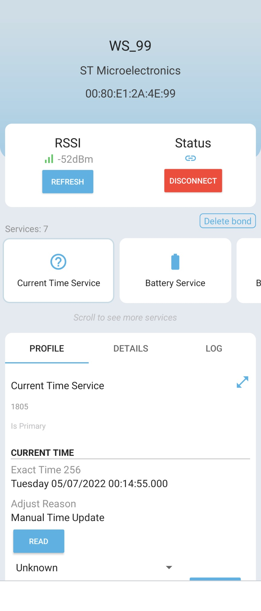
       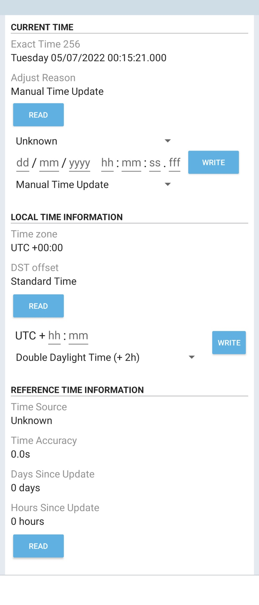
   

	
   When Selecting the [Battery Service 1.0](https://www.bluetooth.com/specifications/specs/battery-service-1-0/) you will see the following Characteristics:
   

       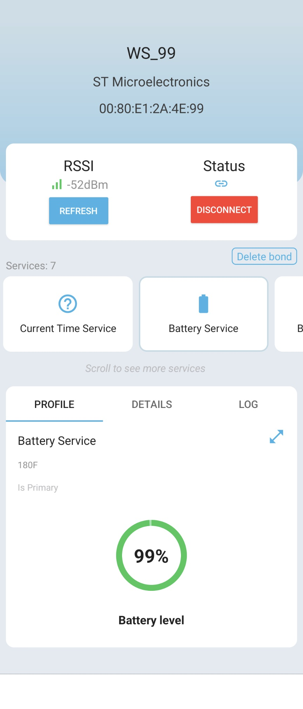
   

	
3) Use terminal programs like Tera Term to see the logs of each board via the onboard ST-Link. (115200/8/1/n)

   

       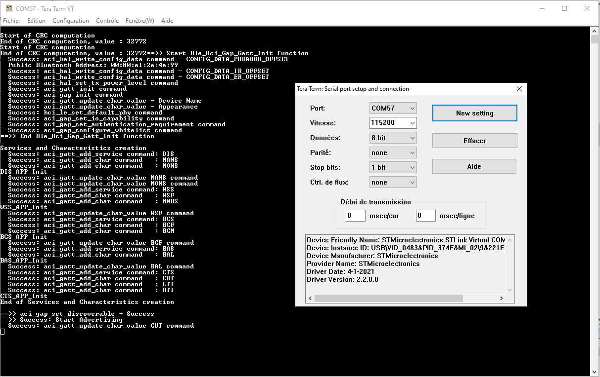
   

## Troubleshooting

**Caution** : Issues and the pull-requests are **not supported** to submit problems or suggestions related to the software delivered in this repository. The STM32WBA-BLE-Weight-Scale example is being delivered as-is, and not necessarily supported by ST.

**For any other question** related to the product, the hardware performance or characteristics, the tools, the environment, you can submit it to the **ST Community** on the STM32 MCUs related [page](https://community.st.com/s/topic/0TO0X000000BSqSWAW/stm32-mcus).